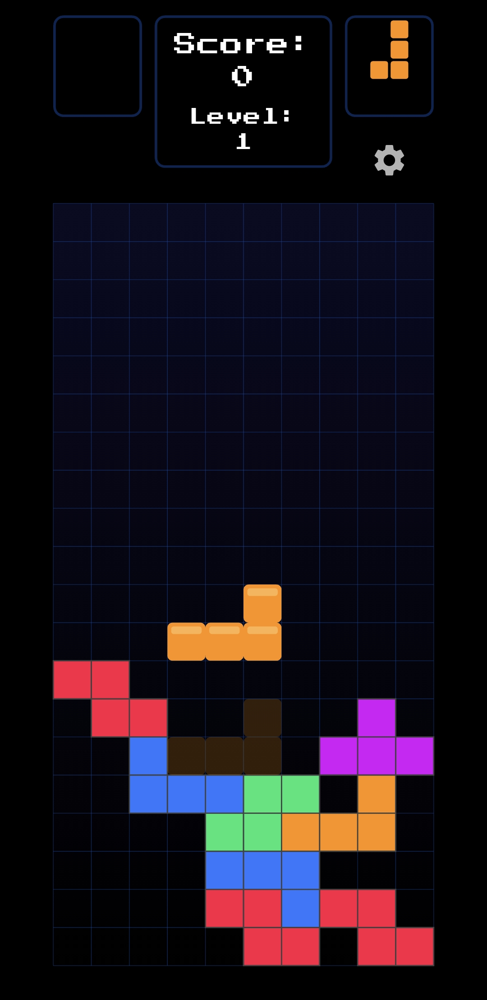

# Tetris Flame 🧱

[](https://opensource.org/licenses/MIT)
[](https://dart.dev)
[](https://flame-engine.org)

Nowoczesna implementacja klasycznej gry Tetris, zbudowana od zera przy użyciu silnika gier **Flame** i frameworka **Flutter**. Projekt ten demonstruje użycie komponentów Flame, zarządzania stanem gry, obsługi zdarzeń (dotyk, przeciąganie) oraz integracji z natywnymi funkcjami Fluttera.

---

> **Uwaga:** Oto podgląd rozgrywki!
>
> 

## 🎮 Kluczowe Funkcje

* **Pełna mechanika Tetrisa:** Płynne przesuwanie, obracanie i opadanie klocków.
* **Wizualny "Duch" (Ghost Piece):** Przezroczysty podgląd pokazujący dokładne miejsce lądowania klocka.
* **System "Hold":** Możliwość przechowania jednego klocka na później.
* **Podgląd Następnego Klocka:** Widok "Next" pokazujący kolejny tetromino.
* **Punktacja i Poziomy:** System punktacji (Single, Double, Triple, Tetris) oraz poziomy, które przyspieszają grę co 10 wyczyszczonych linii.
* **Zapisywanie Wyników:** Automatyczne zapisywanie 5 najlepszych wyników (High Scores) lokalnie na urządzeniu.
* **Zarządzanie Dźwiękiem:** Pełna obsługa muzyki w tle i efektów dźwiękowych (SFX) z możliwością ich wyłączenia w menu ustawień.
* **Płynne Animacje:** Animacja migania przy czyszczeniu linii.
* **Responsywne Sterowanie:** Intuicyjne sterowanie dotykowe:
    * **Stuknięcie:** Obrót
    * **Przeciąganie poziome:** Ruch lewo/prawo
    * **Przeciąganie pionowe:** Miękkie opadanie (Soft Drop)
    * **Długie przytrzymanie:** Przechowanie klocka (Hold)

## 🛠️ Technologie

Projekt wykorzystuje następujące technologie:

* **[Flutter](https://flutter.dev/)**: Framework do budowania natywnie kompilowanych aplikacji mobilnych, webowych i desktopowych.
* **[Flame](https://flame-engine.org/)**: Minimalistyczny silnik gier 2D dla Fluttera, odpowiedzialny za pętlę gry, komponenty (ECS) i wykrywanie wejść.
* **[FlameAudio](https://docs.flame-engine.org/latest/flame_audio/flame_audio.html)**: Oficjalny pakiet Flame do obsługi muzyki w tle i efektów dźwiękowych.
* **[SharedPreferences](https://pub.dev/packages/shared_preferences)**: Pakiet do trwałego zapisywania prostych danych (najlepsze wyniki i ustawienia audio).
* **[Dart](https://dart.dev/)**: Język programowania zoptymalizowany pod kątem tworzenia aplikacji klienckich.

## 🚀 Instalacja i Uruchomienie

Aby uruchomić projekt lokalnie, wykonaj następujące kroki:

1.  **Sklonuj repozytorium:**
    ```bash
    git clone https://github.com/Flamstak/Tetris-game.git
    cd Tetris-game
    ```


2.  **Pobierz zależności Fluttera:**
    ```bash
    flutter pub get
    ```

3.  **Uruchom aplikację:**
    Upewnij się, że masz podłączone urządzenie lub uruchomiony emulator.
    ```bash
    flutter run
    ```

## 🕹️ Sterowanie

* **Przesuń (lewo/prawo):** Przeciągnij palcem w poziomie po ekranie.
* **Obróć:** Szybko stuknij w ekran.
* **Miękkie Opadanie (Soft Drop):** Przeciągnij palcem w dół.
* **Przechowaj (Hold):** Przytrzymaj palcem (długie naciśnięcie) w dowolnym miejscu ekranu.
* **Pauza / Ustawienia:** Naciśnij ikonę ⚙️ w prawym górnym rogu.
* **Restart (po przegranej):** Stuknij w ekran "Game Over".

## 📄 Licencja

Ten projekt jest udostępniony na licencji MIT. Zobacz plik `LICENSE`, aby uzyskać więcej informacji.